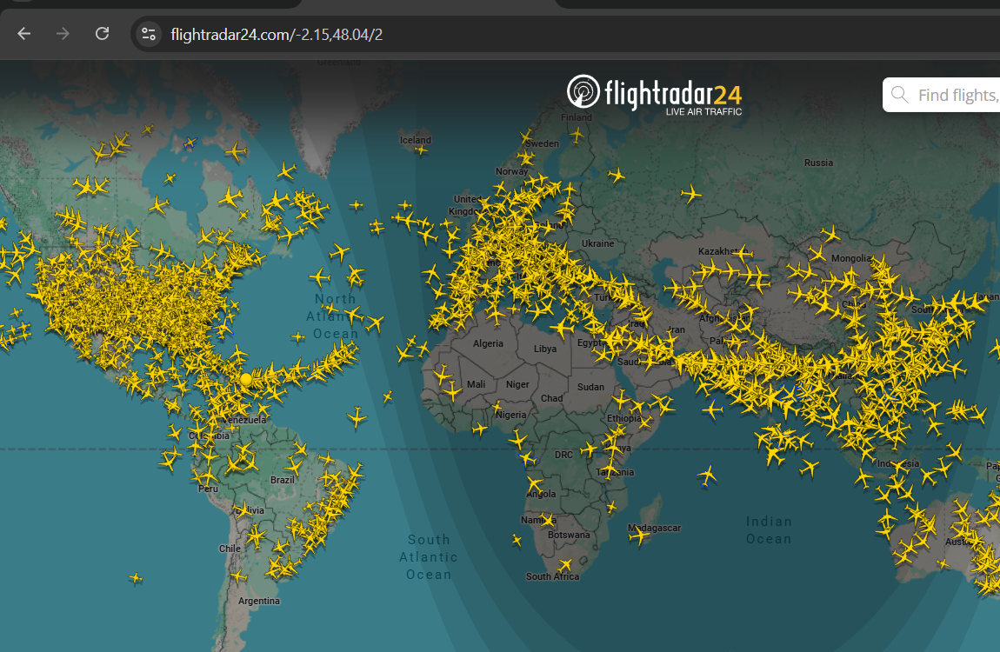

# Accessing Flightradar24: Live Flight Tracking

## What is Flightradar24?

Flightradar24 is a free, open-source OSINT (Open Source Intelligence) tool that provides real-time flight tracking across the globe. It displays live aircraft positions on an interactive map using ADS-B (Automatic Dependent Surveillance-Broadcast) data.

## How to Access Flightradar24

1. **Visit the Website**: Go to [https://flightradar24.com](https://flightradar24.com) in your web browser
2. **Interactive Map**: The homepage displays a live world map showing active aircraft in real-time with yellow airplane icons
3. **Search Flights**: Use the search bar to find specific flights, airports, or airlines
4. **Filter Options**: Click on the filter icon to sort flights by type, airline, and more
5. **Premium Features**: While the basic version is free, premium features offer:
   - Longer flight history (60+ days)
   - 3D view of aircraft
   - Aviation weather data
   - And more...

## Key Features

- **Real-time tracking**: See aircraft positions updated continuously
- **Flight details**: Click on any aircraft to view flight information
- **Airport information**: Search for specific airports and view their traffic
- **Free access**: No registration required for basic features
- **Global coverage**: Track flights worldwide

